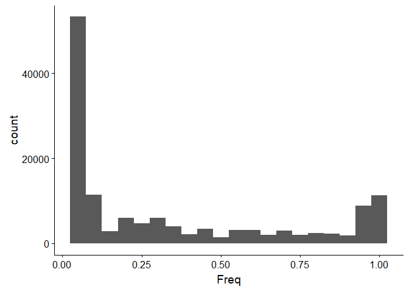
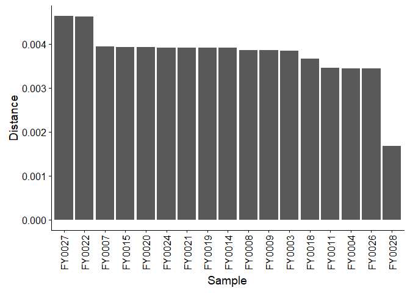
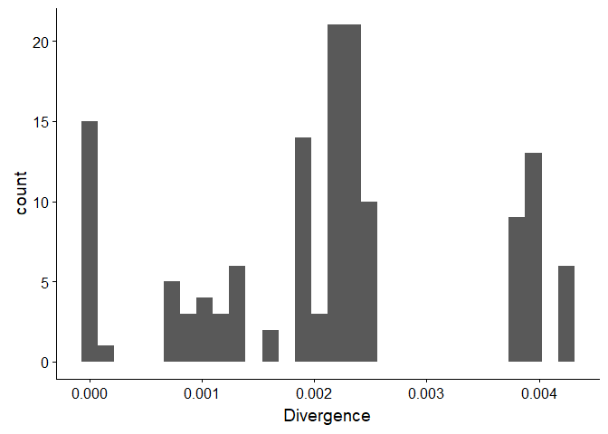
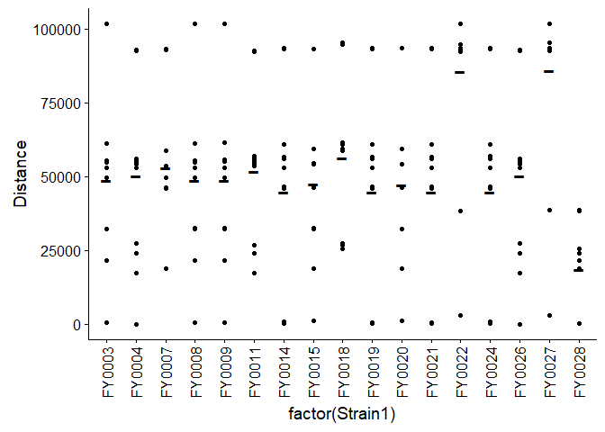
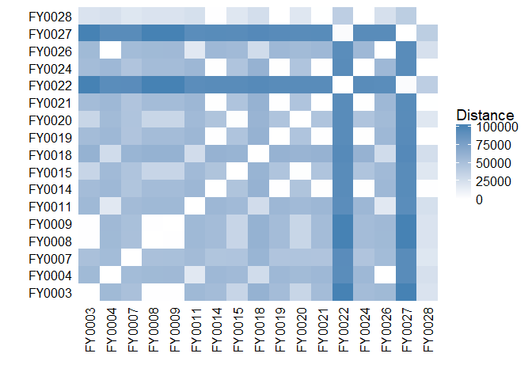
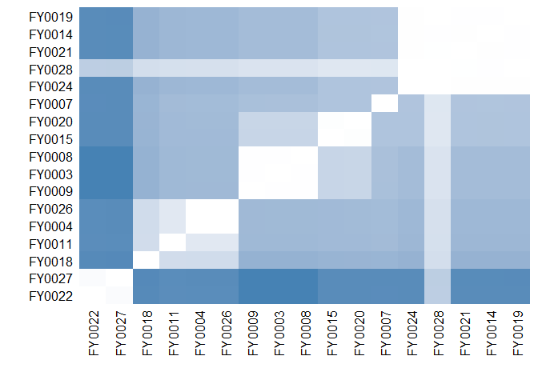

Perform basic operations with VCF files.
================

    ##  [1] "FY0003" "FY0004" "FY0007" "FY0008" "FY0009" "FY0011" "FY0014"
    ##  [8] "FY0015" "FY0018" "FY0019" "FY0020" "FY0021" "FY0022" "FY0024"
    ## [15] "FY0026" "FY0027" "FY0028"

``` r
library(dplyr)
library(tidyr)
library(stringr)
library(ggplot2)
library(cowplot)
library(lazyeval)
library(ggdendro)
library(foreach)

# Convert genotype matrix to a dataframe for manipulation with dplyr.
Data <- as.data.frame(GT)
Data$SNP <- row.names(GT)

# Convert data to tidy format.
Data <- Data %>% gather(Sample, Genotype, FY0003:FY0028)

# Parse SNP annotation.
Data <- Data %>% 
  separate(SNP, into=c("Genome","Chr","Pos","Ref","Alt"), sep=":|_|/", remove=FALSE) %>%
  mutate(Chr=paste(Genome,Chr,sep="_")) %>%
  select(-Genome)
Data <- Data %>%
  mutate(Genotype=ifelse(Genotype==".","./.",Genotype)) %>%
  separate(Genotype, into=c("A1","A2"), sep="/", remove=FALSE)
Data$Pos <- as.integer(Data$Pos)
Data <- Data %>% arrange(Chr, Pos)
Data$A1 <- as.integer(Data$A1)
Data$A2 <- as.integer(Data$A2)

# Calculate distance from reference at each site for each sample.
# This value should be 0, 1, or 2.
# All alternate alleles count the same.
Data <- Data %>%
  mutate(Distance=ifelse(A1>1,1,A1)+ifelse(A2>1,1,A2))
```

``` r
# Calculate the allele frequency at each variant.
AlleleFreq <- Data %>%
  filter(!is.na(Distance)) %>%
  group_by(SNP, Chr, Pos, Ref, Alt) %>%
  summarize(Freq=sum(Distance)/(2*sum(n()))) %>%
  arrange(Chr, Pos)

# Plot site frequency spectrum.
ggplot(AlleleFreq) +
  geom_histogram(aes(x=Freq), binwidth=0.05)
```



``` r
# Calculate the distance of each variant from the reference sequence.
# Double-count alleles that are homozygous alternate.
StrainDistance <- Data %>%
  filter(!is.na(Distance)) %>%
  group_by(Sample) %>% summarize(Distance=sum(Distance)/(2*12e6)) %>%
  arrange(desc(Distance))
StrainDistance$Sample <- factor(StrainDistance$Sample, 
                                levels=StrainDistance$Sample)

# Plot each strain's distance from the reference sequence.
ggplot(StrainDistance) +
  geom_bar(aes(x=Sample, y=Distance), stat="identity") +
  theme(axis.text.x=element_text(angle=90, vjust=0.5))
```



``` r
# For the potential hybrid FY0002, calculate the distance from the reference
# in 10kB windows along the genome.
# ggplot(Data %>% filter(Sample=="FY0002", !is.na(Distance)) %>%
#         mutate(Pos=floor(Pos/10000)*10000) %>%
#         group_by(Chr, Pos) %>% summarize(Distance=sum(Distance))) +
#  geom_point(aes(x=Pos, y=Distance)) + 
#  geom_line(aes(x=Pos, y=Distance)) +
#  facet_wrap(~Chr)
```

``` r
# Convert genotype matrix to dataframe.
GT <- as.data.frame(GT)
Strains <- colnames(GT)

# Calculate the pairwise distance of each strain from every other.
PairwiseDistances <- 
  foreach(strain1=rep(unique(Data$Sample), each=length(unique(Data$Sample))),
          strain2=rep(unique(Data$Sample), length(unique(Data$Sample))),
          .combine='rbind') %do% {
            
      # Filter the data to include only one pair of strains.
      # Calculate their distance from one another at each site,
      # and sum this information to calculate their total distance.
      Pair <- GT %>%
        dplyr::select_('strain1', 'strain2') %>%
        filter_(interp(~strain1!=".", strain1=as.name(strain1)),
                interp(~strain2!=".", strain2=as.name(strain2))) %>%
        mutate_(strain1A1=interp(~substr(strain1,1,1), strain1=as.name(strain1)),
                strain1A2=interp(~substr(strain1,3,3), strain1=as.name(strain1)),
                strain2A1=interp(~substr(strain2,1,1), strain2=as.name(strain2)),
                strain2A2=interp(~substr(strain2,3,3), strain2=as.name(strain2))) %>%
        mutate(Distance=ifelse(strain1A1==strain2A1,0,1) +
                 ifelse(strain1A2==strain2A2,0,1)) %>%
        summarize(Distance=sum(Distance))
      c(strain1, strain2, Pair$Distance)
          }

# Clean the data for analysis.
PairwiseDistances <- as.data.frame(PairwiseDistances, stringsAsFactors=FALSE)
colnames(PairwiseDistances) <- c("Strain1", "Strain2", "Distance")
PairwiseDistances$Strain1 <- as.character(PairwiseDistances$Strain1)
PairwiseDistances$Strain2 <- as.character(PairwiseDistances$Strain2)
PairwiseDistances$Distance <- as.numeric(PairwiseDistances$Distance)

# Calculate genome-wide divergence, averaged between diploid genomes. 
PairwiseDistances <- PairwiseDistances %>%
  mutate(Divergence=Distance/(2*12e6)) %>%
  arrange(Divergence, Strain1)
# Before plotting, filter distances to remove replicates.
ggplot(PairwiseDistances %>%
         filter(match(Strain1, Strains) < match(Strain2, Strains))) + 
  geom_histogram(aes(x=Divergence), bins=30)
```



``` r
# Plot the distance of each strain from every other strain.
# Calculate the average distance of each strain from each other strain
# to identify outliers.
ggplot(PairwiseDistances %>%
         filter(Strain1 != Strain2)) +
  geom_point(aes(x=factor(Strain1), y=Distance)) +
  geom_point(data= PairwiseDistances %>% group_by(Strain1) %>%
         filter(Strain1 != Strain2) %>%
         summarize(MeanDistance=mean(Distance),
                   MeanDivergence=mean(Divergence)) %>%
         arrange(MeanDistance),
         aes(x=Strain1, y=MeanDistance), pch='-', size=10) +
  theme(axis.text.x=element_text(angle=90, vjust=0.5))
```



``` r
# Plot a heatmap of the pairwise distances.
ggplot(PairwiseDistances) +
  geom_tile(aes(x=Strain1, y=Strain2, fill=Distance)) +
  scale_fill_gradient(low = "white", high = "steelblue") +
  xlab("") + ylab("") +
  scale_x_discrete(expand=c(0,0)) + scale_y_discrete(expand=c(0,0)) +
  theme(axis.text.x=element_text(angle=90, vjust=0.5),
        axis.ticks=element_blank(),
        axis.line = element_blank())
```



``` r
# Convert the pairwise distance dataframe into a matrix.
Distances <- PairwiseDistances %>%
  dplyr::select(Strain1, Strain2, Distance) %>%
  spread(Strain2, Distance) %>% dplyr::select(-Strain1)
rownames(Distances) <- colnames(Distances)
Distances <- as.matrix(Distances)

# Plot the dendrogram that results from hierarchical clustering.
Hclust <- hclust(as.dist(Distances))
Dendrogram <- ggdendrogram(Hclust)

# Plot the dendrogram together with the heatmap 
# representing all pairwise relationships.
HclustDendro <- as.dendrogram(Hclust)
Distances <- as.data.frame(Distances[order.dendrogram(HclustDendro),
                       order.dendrogram(HclustDendro)], stringsAsFactors=FALSE)
SortedHeatmap <- 
  ggplot(PairwiseDistances %>%
         mutate(Strain1=factor(Strain1, levels=row.names(Distances)),
                Strain2=factor(Strain2, levels=row.names(Distances)))) +
  geom_tile(aes(x=Strain1, y=Strain2, fill=Distance)) +
  scale_fill_gradient(low = "white", high = "steelblue") +
  xlab("") + ylab("") +
  scale_x_discrete(expand=c(0,0)) + scale_y_discrete(expand=c(0,0)) +
  theme(axis.text.x=element_text(angle=90, vjust=0.5),
        axis.ticks=element_blank(),
        axis.line = element_blank()) +
  guides(fill=FALSE)
SortedHeatmap
```



``` r
# Combine dendrogram and heatmap.
#p <- plot_grid(Dendrogram, SortedHeatmap, ncol=1, 
#               rel_heights=c(2,3.5))
#p
```
