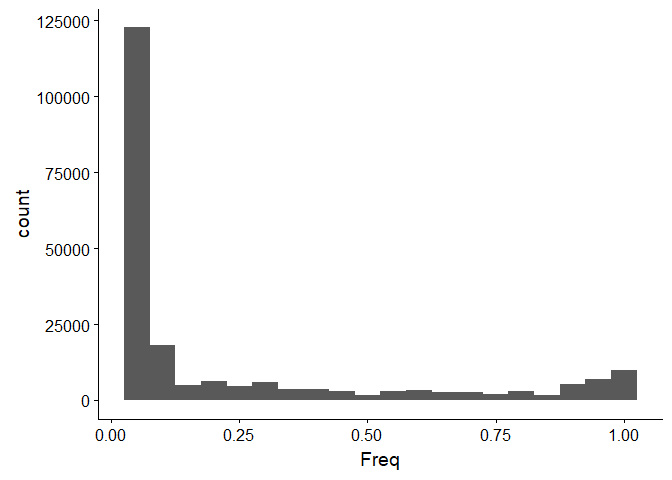
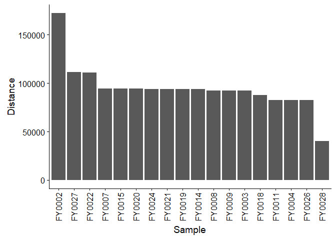
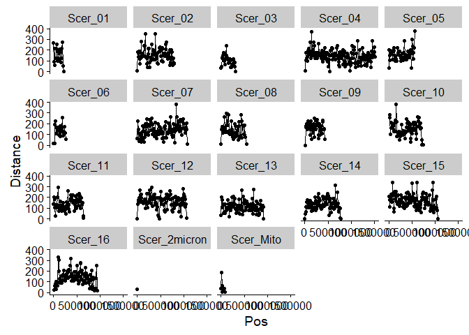

Perform basic operations with VCF files.
================

    ##  [1] "FY0002" "FY0003" "FY0004" "FY0007" "FY0008" "FY0009" "FY0011"
    ##  [8] "FY0014" "FY0015" "FY0018" "FY0019" "FY0020" "FY0021" "FY0022"
    ## [15] "FY0024" "FY0026" "FY0027" "FY0028"

``` r
library(dplyr)
library(tidyr)
library(stringr)
library(ggplot2)
library(cowplot)

# Convert genotype matrix to a dataframe for manipulation with dplyr.
Data <- as.data.frame(GT)
Data$SNP <- row.names(GT)

# Convert data to tidy format.
Data <- Data %>% gather(Sample, Genotype, FY0002:FY0028)

# Parse SNP annotation.
Data <- Data %>% 
  separate(SNP, into=c("Genome","Chr","Pos","Ref","Alt"), sep=":|_|/", remove=FALSE) %>%
  mutate(Chr=paste(Genome,Chr,sep="_")) %>%
  select(-Genome)
Data <- Data %>%
  mutate(Genotype=ifelse(Genotype==".","./.",Genotype)) %>%
  separate(Genotype, into=c("A1","A2"), sep="/", remove=FALSE)
Data$Pos <- as.integer(Data$Pos)
Data <- Data %>% arrange(Chr, Pos)
Data$A1 <- as.integer(Data$A1)
Data$A2 <- as.integer(Data$A2)

# Calculate distance from reference at each site for each sample.
# This value should be 0, 1, or 2.
# All alternate alleles count the same.
Data <- Data %>%
  mutate(Distance=ifelse(A1>1,1,A1)+ifelse(A2>1,1,A2))

# Calculate the allele frequency at each variant.
AlleleFreq <- Data %>%
  filter(!is.na(Distance)) %>%
  group_by(SNP, Chr, Pos, Ref, Alt) %>%
  summarize(Freq=sum(Distance)/(2*sum(n()))) %>%
  arrange(Chr, Pos)

# Plot site frequency spectrum.
ggplot(AlleleFreq) +
  geom_histogram(aes(x=Freq), binwidth=0.05)
```



``` r
# Calculate the distance of each variant from the reference sequence.
# Double-count alleles that are homozygous alternate.
StrainDistance <- Data %>%
  filter(!is.na(Distance)) %>%
  group_by(Sample) %>% summarize(Distance=sum(Distance)) %>%
  arrange(desc(Distance))
StrainDistance$Sample <- factor(StrainDistance$Sample, 
                                levels=StrainDistance$Sample)

# Plot each strain's distance from the reference sequence.
ggplot(StrainDistance) +
  geom_bar(aes(x=Sample, y=Distance), stat="identity") +
  theme(axis.text.x=element_text(angle=90, vjust=0.5))
```



``` r
# For the potential hybrid FY0002, calculate the distance from the reference
# in 10kB windows along the genome.
ggplot(Data %>% filter(Sample=="FY0002", !is.na(Distance)) %>%
         mutate(Pos=floor(Pos/10000)*10000) %>%
         group_by(Chr, Pos) %>% summarize(Distance=sum(Distance))) +
  geom_point(aes(x=Pos, y=Distance)) + 
  geom_line(aes(x=Pos, y=Distance)) +
  facet_wrap(~Chr)
```


