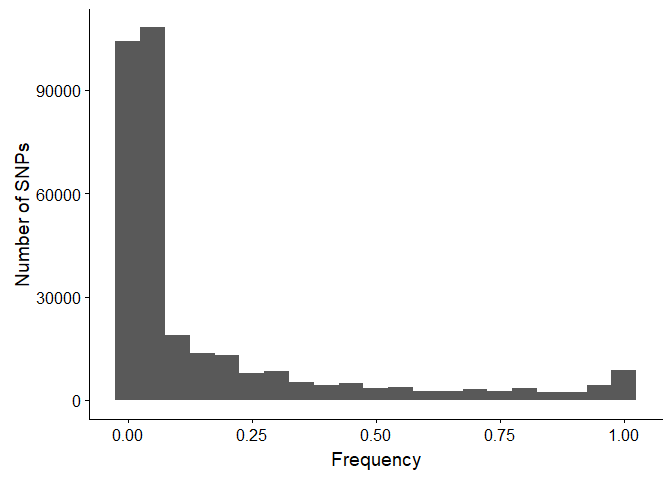
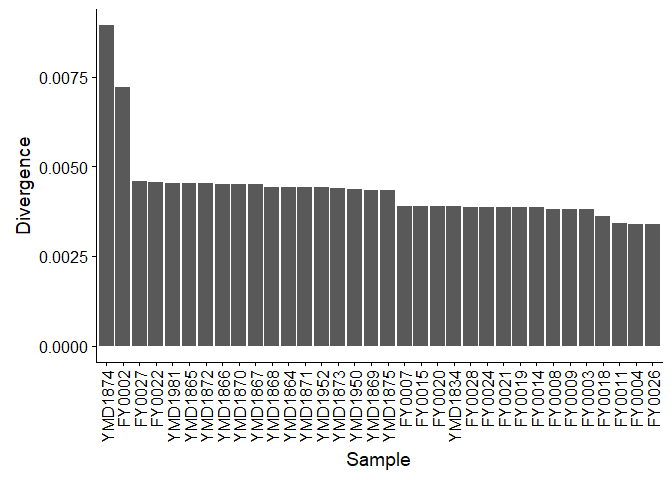
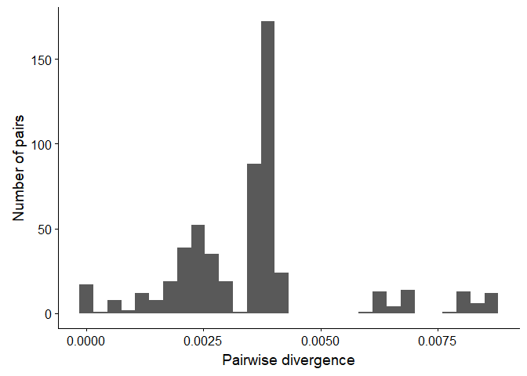
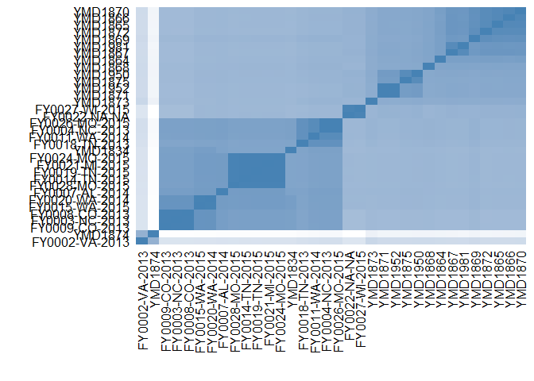

Perform basic operations with VCF files.
================

``` r
# Read in metadata for FY strains.
Metadata <- read.table("../../../data/BB/metadata-formatted.txt", header=TRUE,
                       stringsAsFactors = FALSE, sep="\t")
Metadata <- Metadata %>%
  dplyr::select(ProjectName, Type, Genus, 
                CaptureMethod, CaptureDescription, CaptureDate, City, State) %>%
  mutate(Strain=ProjectName) %>% dplyr::select(-ProjectName)

# Clean up date formatting.
Metadata <- Metadata %>%
  mutate(Date=mdy(CaptureDate), Year=year(Date)) %>% 
  arrange(Date) %>% dplyr::select(-CaptureDate)

# For this analysis, retain only information for S. cerevisiae strains.
# Metadata <- Metadata %>% filter(ProjectName %in% PairwiseDistances$Strain1) %>%
#  mutate(Strain=ProjectName) %>% dplyr::select(-ProjectName)

# Create a unique name for each strain with annotation information
# about time and location of collection.
Metadata <- Metadata %>% mutate(StrainLong=paste(Strain,State,Year,sep="-"))

# Write a function to generate the strain name with annotations,
# given the shorter strain name.
# Note that not all strains have the same types of annotations.
StrainToStrainLong <- function(strain){
  strainlong <- strain
  if(strain %in% Metadata$Strain){
    strainlong <- Metadata$StrainLong[match(strain, Metadata$Strain)]
  }
  return(strainlong)
}
```

``` r
# Read in the VCF. Make sure the reference genome has been installed.
vcf <- readVcf("../../../nobackup/BB/170815-AlignScer/Scer-snps-filtered.vcf", "sacCer3")

# Extract the genotypes as a matrix.
GT <- geno(vcf)$GT

# Convert genotype matrix to a dataframe for manipulation with dplyr.
Data <- as.data.frame(GT)
Data$SNP <- row.names(GT)

# Convert data to tidy format.
Data <- Data %>% gather(Sample, Genotype,`FY0002-S288C`:`YMD1981-S288C`)

# Give samples more abbreviated names.
Data <- Data %>% separate(Sample, into=c("Sample", "Ref"), sep="-") %>%
  dplyr::select(-Ref)

# Parse SNP annotation.
Data <- Data %>% 
  separate(SNP, into=c("Genome","Chr","Pos","Ref","Alt"), sep=":|_|/", remove=FALSE) %>%
  mutate(Chr=paste(Genome,Chr,sep="_")) %>%
  select(-Genome)
Data <- Data %>%
  mutate(Genotype=ifelse(Genotype==".","./.",Genotype)) %>%
  separate(Genotype, into=c("A1","A2"), sep="/", remove=FALSE)
Data$Pos <- as.integer(Data$Pos)
Data <- Data %>% arrange(Chr, Pos)
Data$A1 <- as.integer(Data$A1)
Data$A2 <- as.integer(Data$A2)

# Calculate distance from reference at each site for each sample.
# This value should be 0, 1, or 2.
# All alternate alleles count the same.
Data <- Data %>%
  mutate(Distance=ifelse(A1>1,1,A1)+ifelse(A2>1,1,A2))
```

``` r
# Calculate the allele frequency at each variant.
AlleleFreq <- Data %>%
  filter(!is.na(Distance)) %>%
  group_by(SNP, Chr, Pos, Ref, Alt) %>%
  summarize(Freq=sum(Distance)/(2*sum(n()))) %>%
  arrange(Chr, Pos)

# Plot site frequency spectrum.
ggplot(AlleleFreq) +
  geom_histogram(aes(x=Freq), binwidth=0.05) +
  xlab("Frequency") + ylab("Number of SNPs")
```



``` r
# Calculate the distance of each variant from the reference sequence.
# Double-count alleles that are homozygous alternate.
StrainDistance <- Data %>%
  filter(!is.na(Distance)) %>%
  group_by(Sample) %>% summarize(Distance=sum(Distance)/(2*12e6)) %>%
  arrange(desc(Distance))
StrainDistance$Sample <- factor(StrainDistance$Sample, 
                                levels=StrainDistance$Sample)

# Plot each strain's distance from the reference sequence.
ggplot(StrainDistance) +
  geom_bar(aes(x=Sample, y=Distance), stat="identity") +
  theme(axis.text.x=element_text(angle=90, vjust=0.5, hjust=1)) +
  xlab("Sample") + ylab("Divergence")
```



``` r
# Convert genotype matrix to dataframe.
GT <- as.data.frame(GT)
Strains <- colnames(GT)

# Calculate the pairwise distance of each strain from every other.
PairwiseDistances <- 
  foreach(strain1=rep(unique(Strains), each=length(unique(Strains))),
          strain2=rep(unique(Strains), length(unique(Strains))),
          .combine='rbind') %do% {
            
      # Filter the data to include only one pair of strains.
      # Calculate their distance from one another at each site,
      # and sum this information to calculate their total distance.
      Pair <- GT %>%
        dplyr::select_('strain1', 'strain2') %>%
        filter_(interp(~strain1!=".", strain1=as.name(strain1)),
                interp(~strain2!=".", strain2=as.name(strain2))) %>%
        mutate_(strain1A1=interp(~substr(strain1,1,1), strain1=as.name(strain1)),
                strain1A2=interp(~substr(strain1,3,3), strain1=as.name(strain1)),
                strain2A1=interp(~substr(strain2,1,1), strain2=as.name(strain2)),
                strain2A2=interp(~substr(strain2,3,3), strain2=as.name(strain2))) %>%
        mutate(Distance=ifelse(strain1A1==strain2A1,0,1) +
                 ifelse(strain1A2==strain2A2,0,1)) %>%
        summarize(Distance=sum(Distance))
      c(strain1, strain2, Pair$Distance)
          }

# Clean the data for analysis.
PairwiseDistances <- as.data.frame(PairwiseDistances, stringsAsFactors=FALSE)
colnames(PairwiseDistances) <- c("Strain1", "Strain2", "Distance")
PairwiseDistances$Strain1 <- as.character(PairwiseDistances$Strain1)
PairwiseDistances$Strain2 <- as.character(PairwiseDistances$Strain2)
PairwiseDistances$Distance <- as.numeric(PairwiseDistances$Distance)

# Shorten the name of each strain.
PairwiseDistances <- PairwiseDistances %>%
  separate(Strain1, into=c("Strain1","Ref1"), sep="-") %>%
  separate(Strain2, into=c("Strain2","Ref2"), sep="-") %>%
  dplyr::select(-Ref1, -Ref2)

# Add strain metadata.
PairwiseDistances$Strain1 <- sapply(PairwiseDistances$Strain1, StrainToStrainLong)
PairwiseDistances$Strain2 <- sapply(PairwiseDistances$Strain2, StrainToStrainLong)

# Calculate genome-wide divergence, averaged between diploid genomes. 
PairwiseDistances <- PairwiseDistances %>%
  mutate(Divergence=Distance/(2*12e6)) %>%
  arrange(Divergence, Strain1)

# Before plotting, filter distances to remove replicates.
Strains <- sort(unique(PairwiseDistances$Strain1))
ggplot(PairwiseDistances %>%
         filter(match(Strain1, Strains) < match(Strain2, Strains))) + 
  geom_histogram(aes(x=Divergence), bins=30) +
  xlab("Pairwise divergence") + ylab("Number of pairs")
```



``` r
# Plot the distance of each strain from every other strain.
# Calculate the average distance of each strain from each other strain
# to identify outliers.
ggplot(PairwiseDistances %>%
         filter(Strain1 != Strain2)) +
  geom_point(aes(x=factor(Strain1), y=Distance)) +
  geom_point(data= PairwiseDistances %>% group_by(Strain1) %>%
         filter(Strain1 != Strain2) %>%
         summarize(MeanDistance=mean(Distance),
                   MeanDivergence=mean(Divergence)) %>%
         arrange(MeanDistance),
         aes(x=Strain1, y=MeanDistance), pch='-', size=10) +
  theme(axis.text.x=element_text(angle=90, vjust=0.5))
```


``` r
# Plot a heatmap of the pairwise distances.
ggplot(PairwiseDistances) +
  geom_tile(aes(x=Strain1, y=Strain2, fill=Distance)) +
  scale_fill_gradient(low = "steelblue", high = "white") +
  xlab("") + ylab("") +
  scale_x_discrete(expand=c(0,0)) + scale_y_discrete(expand=c(0,0)) +
  theme(axis.text.x=element_text(angle=90, vjust=0.5, hjust=1),
        axis.ticks=element_blank(),
        axis.line = element_blank())
```


``` r
# List top ten most closely related pairs of strains.
kable(head(PairwiseDistances %>% 
       filter(match(Strain1, Strains) < match(Strain2, Strains)) %>% 
                arrange(Distance), 20))
```

| Strain1        | Strain2        |  Distance|  Divergence|
|:---------------|:---------------|---------:|-----------:|
| FY0004-NC-2013 | FY0026-MO-2015 |         0|   0.0000000|
| FY0003-NC-2013 | FY0008-CO-2013 |       483|   0.0000201|
| FY0003-NC-2013 | FY0009-CO-2013 |       521|   0.0000217|
| FY0014-TN-2015 | FY0019-TN-2015 |       545|   0.0000227|
| FY0019-TN-2015 | FY0021-MI-2015 |       546|   0.0000228|
| FY0008-CO-2013 | FY0009-CO-2013 |       569|   0.0000237|
| FY0019-TN-2015 | FY0024-MO-2015 |       661|   0.0000275|
| FY0021-MI-2015 | FY0024-MO-2015 |       662|   0.0000276|
| FY0014-TN-2015 | FY0021-MI-2015 |       668|   0.0000278|
| YMD1871        | YMD1952        |       784|   0.0000327|
| FY0014-TN-2015 | FY0024-MO-2015 |       808|   0.0000337|
| FY0015-WA-2015 | FY0020-WA-2014 |      1028|   0.0000428|
| FY0024-MO-2015 | FY0028-MO-2015 |      1689|   0.0000704|
| FY0019-TN-2015 | FY0028-MO-2015 |      1870|   0.0000779|
| FY0021-MI-2015 | FY0028-MO-2015 |      1929|   0.0000804|
| FY0014-TN-2015 | FY0028-MO-2015 |      2048|   0.0000853|
| FY0022-NA-NA   | FY0027-WI-2015 |      3078|   0.0001282|
| YMD1866        | YMD1870        |      8983|   0.0003743|
| YMD1865        | YMD1866        |     12505|   0.0005210|
| YMD1865        | YMD1870        |     12671|   0.0005280|

``` r
# Convert the pairwise distance dataframe into a matrix.
Distances <- PairwiseDistances %>%
  dplyr::select(Strain1, Strain2, Distance) %>%
  spread(Strain2, Distance) %>% dplyr::select(-Strain1)
rownames(Distances) <- colnames(Distances)
Distances <- as.matrix(Distances)

# Plot the dendrogram that results from hierarchical clustering.
Hclust <- hclust(as.dist(Distances))
Dendrogram <- ggdendrogram(Hclust)

# Plot the dendrogram together with the heatmap 
# representing all pairwise relationships.
HclustDendro <- as.dendrogram(Hclust)
Distances <- as.data.frame(Distances[order.dendrogram(HclustDendro),
                       order.dendrogram(HclustDendro)], stringsAsFactors=FALSE)
PairwiseDistances <- PairwiseDistances %>%
         mutate(Strain1=factor(Strain1, levels=colnames(Distances)),
                Strain2=factor(Strain2, levels=colnames(Distances)))
SortedHeatmap <- 
  ggplot(PairwiseDistances) +
  geom_tile(aes(x=Strain1, y=Strain2, fill=Distance)) +
  scale_fill_gradient(low = "steelblue", high = "white") +
  xlab("") + ylab("") +
  scale_x_discrete(expand=c(0,0)) + scale_y_discrete(expand=c(0,0)) +
  theme(axis.text.x=element_text(angle=90, vjust=0.5, hjust=1),
        axis.ticks=element_blank(),
        axis.line = element_blank()) +
  guides(fill=FALSE)
SortedHeatmap
```



``` r
# Combine dendrogram and heatmap.
p <- plot_grid(Dendrogram, SortedHeatmap, ncol=1,
              rel_heights=c(2,3.5))
p
```


